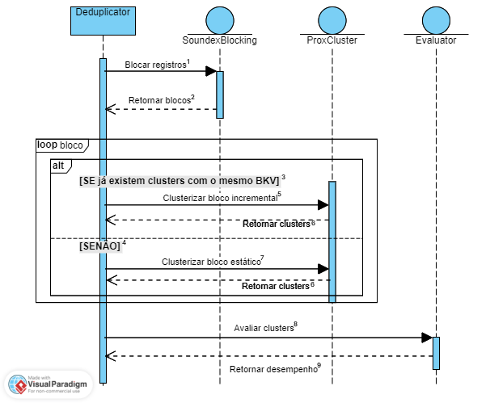

<h1 align="center">
ProxCluster
</h1>

ProxCluster is a modularized framework for
Incremental Entity Resolution that leverages concepts similar to the K-Means algorithm to cluster the duplicates found. This work was developed as the final paper for my Bachelor degree in Computer Science - UFAPE.

👉Undergraduate thesis: TODO add link

## 🔎 Overview

 

  <b>1</b>: Block records  
  <b>2</b>: Return blocks  
  <b>3</b>: IF there is any clusters with the same blocking key value (BKV)  
  <b>4</b>: ELSE  
  <b>5</b>: Cluster incremental block  
  <b>6</b>: Return clusters  
  <b>7</b>: Statically cluster the block  
  <b>8</b>: Evaluate clusters  
  <b>9</b>: Return performance  

 

ProxCluster is divided into 3 modules.

1. Blocking Module (SoundexBlocking and PhonexStaticBlocking) - Responsible for blocking the records (very important step for performance)
2. Matching Module (ProxCluster) - Responsible for comparing, classifying and clustering the records
3. Evaluation Module (Evaluator) - Responsible for evaluating the clusters with a provided gold standard

Even though these modules can be used separately, the Deduplicator class integrates all of them, providing an easy to use abstraction to deduplicate your records with an incremental strategy* included.

In the sequence diagram above, we have the sequence of steps that are taken by the Deduplicator, starting with the blocking of records using the SoundexBlocking module. The returned blocks are traversed in a loop where clustering is performed using the ProxCluster module for each block in the iteration. Note that it is also the responsibility of the Deduplicator to select the previously resolved clusters in the case of Incremental Entity Resolution\* of blocks with the same BKV. Finally, the performance of the generated clusters can be evaluated using the Evaluator class.

\* In this work Incremental Entity Resolution is a strategy that makes possible to reuse the results (duplicates found in previous processes) when new records arrive, on the contrary of the static approach, where we would need to reprocess everything (old and new records) from the start.

## 🛠 Installation

1. Clone this repo running on your terminal `git clone https://github.com/Gust4voSales/proxcluster-deduplicator`
2. Install dependencies with `pip install -r requirements.txt`
3. You're all set to start using the framework, checkout the experiments folder

## 🧪 Experiments

These were the experiments from the thesis, you can use them as examples to use the framework.

`static_vs_incremental` experiments are a good way to start, they are comparing the static approach vs incremental in three different datasets.
